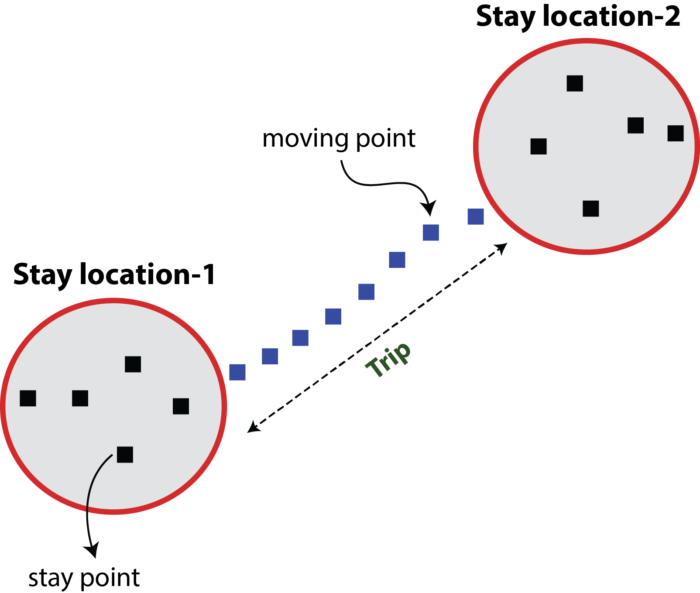

<div style = "text-align: justify">

```{r setup, include=FALSE}
knitr::opts_chunk$set(echo = TRUE, warning = FALSE, message = FALSE)
```

#### Observations
The project **"Exploring Beijing Taxis GPS data"** is submitted as the final project for the course Análise de Dados para as Ciências Sociais (FLS6397) offered at the Department of Political Science, University of São Paulo. The project is developed based on the principles and techniques discussed in the course, prioritizing the clarity and organization of the script and the good practices of data science and programming. Therefore, certain parts of the analysis consider simple assumptions and may not represent the actual complexity of a scientific problem. The project instructions are found [here](https://jonnyphillips.github.io/Ciencia_de_Dados/projeto.html). **The complete project and instructions for reproducibility are available on [Github](https://github.com/jeevgidd/FLS6397-Final-Project).**

### 1. Introduction
Global Positioning System (GPS) technology has revolutionized the fields of mapping and navigation. The present-day industries such as aviation, marine, surveying, and military have been extensively using the services offered by GPS technology. Its application in transportation systems has become widespread for the past two decades, mainly by the introduction of in-vehicle GPS facilities that allowed effective navigation and monitoring of vehicle location. As GPS-enabled smartphones have become mainstream, services such as route guidance, analyzing traffic movements, estimating fast routes, and predicting travel duration became commercially viable.

In the present project, we explore the location history data of taxis in the Beijing municipality recorded from February 2 to February 8, 2008. The original data set published by Microsoft consists of trajectories of 33,000 taxis, and a sample of 10,357 taxi trajectories are available on the [Microsoft website](https://www.microsoft.com/en-us/research/publication/t-drive-trajectory-data-sample/). We begin with analyzing and exploring a single taxi trajectory and finally perform aggregate analysis of a few taxi trajectories. The aggregate analysis will not include the data of 10,357 taxis because of the computational limitations.  

#### Important definitions
1. **Stay location:** Stay location is defined as a location where the taxi waited for at least a certain duration.  

2. **Trip:** A trip is defined as a set of GPS points recorded during the travel between one stay location to another stay location.  

3. **Stay point:** Stay points are the GPS points recorded inside a stay location.  

4. **Moving point:** A moving point is one of the GPS points recorded during the travel between one stay location to another stay location.  

**A stay location consists of multiple stay points and a trip consists of multiple moving points.**

<br>
```{r, echo=FALSE, out.width="50%", fig.align = 'center', fig.cap="Schematic representation"}

```

### 2. Objectives

1. **Analysis of an individual taxi trajectory**
    * Calculate the distance between the consecutive GPS points in an individual taxi trajectory. Subsequently, calculate the speeds with which the taxi traveled from one point to another.
    * Classify the GPS points of the trajectory into stay or moving points.
    * Aggregate and label the stay points and moving points into stay locations and trips.
    * Calculate trip duration, speed and identify pickup and drop hours of each trip performed by the taxi.
    * Calculate the stay duration at each stay location and classify them.
    * Visualize the different stay locations and moving points on an interactive map.
2. **Aggregate analysis of multiple taxi trajectories**
    * To import multiple taxi trajectories and repeat the analysis as performed above.
    * Generate aggregated stay location tables and trip tables.
    * Visualize the aggregated stay locations and moving points on a map.
    * Identify the district with highest taxi waiting points.
    * Identify the total number of trips done on each day of the week and each part of the day.
    * Determine the percentage distribution of trips based on the trip duration on each day of the week.
    * Develop a linear regression model based on trip distance and trip duration, and predict the trip duration.

### 3. Analysis
First, we load the required options for our R session. We turn off the scientific notation and assign value 10 to the “pillar.sigfig” option. This allows us to distinguish the decimals of latitude and longitude values. We also load the necessary libraries for our analysis.
```{r options}
# loads required options
options(pillar.sigfig = 10)     # number of digits to appear in a tibble
options(scipen=999)             # turnoff scientific notation
```

```{r libraries}
#load required libraries
library(rmarkdown)          #install.packages("rmarkdown")
library(knitr)              #install.packages("knitr")
library(tidyverse)          #install.packages("tidyverse")
library(sf)                 #install.packages("sf")
library(lwgeom)             #install.packages("lwgeom")
library(ggplot2)            #install.packages("ggplot2")
library(scales)             #install.packages("scales")
library(lubridate)          #install.packages("lubridate")
library(hms)                #install.packages("hms")
library(broom)              #install.packages("broom")
library(DT)                 #install.packages("DT")
library(mapview)            #install.packages("mapview")
library(ggpubr)             #install.packages("ggpubr")
library(tmaptools)          #install.packages("tmaptools")
library(stargazer)          #install.packages("stargazer")
library(Zelig)              #install.packages("Zelig")
```

The GPS trajectory data file of each taxi contains four columns(refer user guide available in the taxi_data folder).
1. Taxi ID  
2. Date and time when the coordinates were recorded  
3. Longitude  
4. Latitude  
The data is ordered by the date and time column. First, we only import and work with data from one taxi (TAXI 48) and assign the respective column names.

```{r import_single}
# imports only one taxi file (48.txt) data from taxi_data folder. 
# separator and column names are assigned as necessary (refer user_guide.pdf)

taxi <- read_delim("taxi_data/48.txt", 
                   delim = ",", col_names = FALSE) %>%
  set_names(c("taxi_id","date_time","longitude","latitude")) 

head(taxi)
```

We check if the GPS records are duplicated. Duplicate rows imply the same coordinates recorded at the same time. We use the distinct() function to eliminate duplicated rows.  

```{r removeduplicates}
# excludes duplicated rows (coordinates recorded at the same time).
taxi_df1 <- taxi %>% distinct()

b <- nrow(taxi_df1) #number of rows after applying distinct
a <- nrow(taxi) #number of rows in original data set
```

`r a-b` observations (rows) were identified as duplicated rows. Therefore we use the new tibble generated after applying the distinct() function for the rest of our analysis. We also add a new column consisting of row numbers which serve as unique ID numbers for our GPS records.  

<br>
```{r rows_n_newcolumn}

taxi_df1 <- taxi_df1 %>% 
  mutate(data_id = row_number()) %>%                        # creates new column with row numbers 
  select(data_id, taxi_id, date_time, longitude, latitude)  # saves the tibble with columns in a respective order

head(taxi_df1)
```

We extract the year, month, day, time, hours, minutes, and seconds information from the date_time column and save each one of them in a new column. For this, we use the hms library functions. In addition, we save the day of the week information (Monday to Sunday) using the date information from the date_time column.   

<br>
```{r extractinfo}
taxi_df1 <- taxi_df1 %>%
  mutate(time = as_hms(date_time),              # extracts and saves only time from data_time column  
         year = year(date_time),                # extracts and saves only year as numeric
         month = month(date_time),              # extracts and saves only month as numeric
         day = day(date_time),                  # extracts and saves only day as numeric
         hours = hour(date_time),               # extracts and saves only hours as numeric
         minutes = minute(date_time),           # extracts and saves only minutes as numeric
         seconds = second(date_time),           # extracts and saves only seconds as numeric
         
         # identifies day of the week based on the date
         # format = "%w": Numbers 0 to 6 are assigned to day of the week (0-Sunday, 1-Monday and so on...6-Saturday)
         day_of_week = format(date_time,        
                              format = "%w"),
         
         # identifies day of the week based on the date
         #format = "%A": name of the day of the week
         day_of_week_full = format(date_time,   
                              format = "%A")
         )  

head(taxi_df1)
```

We then create a geometry column using the longitude and latitude columns. We use st_as_sf function of the sf library to convert the tibble into an sf object.  
<br>
```{r converttosf}
#creates geometry using "longitude" and "latitude" columns and assigns CRS as 4326 since the values are in degrees
#remove FALSE makes sure that the original columns are not deleted

taxi_df2 <- taxi_df1 %>% 
    st_as_sf(coords=c("longitude", "latitude"), crs=4326, remove = FALSE)

head(taxi_df2)
```

We then calculate the distances traveled between consecutive GPS points. In other words, the distance at the first GPS point is 0 and at second GPS point is the distance traveled from first and second GPS points and so on. We also calculate the time taken to reach a GPS point from the previously recorded GPS point. Using the distance and time taken values, we calculate the speed with which the taxi was traveled.

<br>
```{r distance_speed}
#function to calculate distance and speed from the geometries created in previous steps

distance_speed <- function(dff) {
  
  dff %>% 
    
    # new column 'geometry_n': extracts from 2nd row to last row of geometry column (NA is assigned as last row)
    # calculates distance between the old geometry and new geometry columns: equivalent to calculating distance between row 1 and row 2 coordinates, row 2 and row 3, and so on in the geometry column
    # by 1000 saves distance in km
    mutate(geometry_n = geometry[row_number() + 1],
         distance = st_distance(geometry, 
                                geometry_n, 
                                by_element = TRUE)/1000) %>% 
    
    # removes geometry_n column generated in previous step
    select(-geometry_n) %>%                     
    
    # moves distance column values one row ahead and saves the distance as numeric from meters units
    mutate(distance = as.numeric(lag(distance))) %>%
    
    # replaces 1st distance NA value with 0
    mutate_at("distance", ~replace(., is.na(.), 0)) %>%
    
    # the difference of time (in hours) is calculated between consecutive coordinates using the date_time column 
    mutate(time_diff = difftime(date_time[row_number()+1], 
                                date_time[row_number()], 
                                units = "hours")) %>%
    
    # moves time difference values one row ahead and saves the time as numeric from hour units
    mutate(time_diff = as.numeric(lag(time_diff))) %>% 
    
    # replaces 1st time difference NA value with 0
    mutate_at("time_diff", ~replace(., is.na(.), 0)) %>% 
    
    # speed calculation
    mutate(speed = distance/time_diff) %>%
    
    # replaces 1st speed NAN value with 0
    mutate_at("speed", ~replace(., is.nan(.), 0))
    
}

# calculates distance speed on the tibble by using above function 
taxi_df2 <- taxi_df2 %>% 
  distance_speed()

head(taxi_df2)

```

Column names | Description
------------- | -------------
distance | Distance traveled from the previous GPS point
time_diff | Time taken to reach the current GPS point from the previous GPS point
speed | The speed with which the taxi reached the current GPS point


Now the distance and speed through time are plotted.
<br>
```{r, out.width = '95%', fig.align = "center"}
#for labels in facet_grid
#named vector with day (in date) as names and day of the week as values
#example: For 2008-02-02: 2 - "Saturday", 2008-02-03: 3 - "Sunday" and so on

dates_day <- taxi_df1 %>% 
  distinct(day, day_of_week_full) %>% 
  deframe()


#distance vs time plot
distance_plot <- taxi_df2 %>% 
    ggplot() + 
    geom_point(aes(time, distance), colour = "#c25353", size = 0.75) + #plot as points with specific colour and size
    
    #breaks: generates a sequence from 0 to end value with 21600 seconds as increment value
    #labels: only hours
    scale_x_time(breaks = seq(0, max(as.numeric(taxi_df2$time)), 21600), 
                 labels = scales::time_format("%H")) +
    ylab("Distance (km)") +
    xlab("Time (hour)") + 
    
    #grouped by day column and arranged column-wise using dates_day named vector as labels
    facet_grid(cols=vars(day), 
               labeller = labeller(.cols = dates_day)) + 
    theme_bw()


#speed vs time plot
speed_plot <- taxi_df2 %>% 
    ggplot() + 
    geom_point(aes(time, speed), colour = "#8181b5", size = 0.75) + #plot as points with specific colour and size
  
    #breaks: generates a sequence from 0 to end value with 21600 seconds as increment value
    #labels: only hours
    scale_x_time(breaks = seq(0, max(as.numeric(taxi_df2$time)), 21600), 
                 labels = scales::time_format("%H")) +
    ylab("Speed (km/hr)") +
    xlab("Time (hour)") +
  
    #grouped by day column and arranged column-wise using dates_day named vector as labels
    facet_grid(cols=vars(day), 
               labeller = labeller(.cols = dates_day)) + 
    theme_bw()


#combined plotting: distance and speed plot
gridExtra::grid.arrange(distance_plot, speed_plot, nrow=2)
```

We see the distance traveled and speed recorded by the taxi were near to zero on Thursday and comparatively less on Friday. We can assume that in this particular period, the taxi driver might not have worked on Thursday. We see that the speed recorded on Tuesday reaches 300 km/hour, which seems unusual. The speed limit on the city express roads and expressways in Beijing is 100 km/hour and 120 km/hour respectively. We can safely assume that these points are outliers because of the satellite errors. Therefore we remove the points with speed above 120 km/hr from the dataset and recalculate the distances and speed.

<br>
```{r distanceVsSpeed, out.width = '80%', fig.align = "center"}

#distance vs speed plot
plot_before <- taxi_df2 %>% 
    ggplot() + 
    geom_point(aes(speed, distance), colour = "#565a61") + #plot as points with specific colour
    
    #adds smoothing line
    geom_smooth(aes(speed, distance), method = lm) + 
    ylab("Distance (km)") +
    xlab("Speed (km/hr)") +
    ggtitle("Before removing outliers") +
    theme_classic()


#removes values with speed more than 100 and re-calculates distance and speed using distance_speed function
taxi_df2 <- taxi_df2 %>% 
  filter(speed < 120) %>% 
  distance_speed()


#distance vs speed plot after filtering based on speed
plot_after <- taxi_df2 %>% 
  ggplot() + 
    geom_point(aes(speed, distance), colour = "#565a61") + #plot as points with specific colour
    
    #adds smoothing line 
    geom_smooth(aes(speed, distance), method = lm) +
    ylab("Distance (km)") +
    xlab("Speed (km/hr)") +
    ggtitle("After removing outliers") +
    theme_classic()


#combined plotting: before and after filtering the data set based on speed
gridExtra::grid.arrange(plot_before, plot_after, ncol=2)

```


As we can see, a linear model plotted with distance and speed before and after removing outliers, the latter one seems to fit better.  
<br>
We then use the distance and time difference variables to identify staying points and moving points of the taxi. Staying point is defined as a

<br>
```{r stay_move}
#function to identify if the recorded coordinates are staying or moving points

stay_moving <- function(df) {
  
  #if the distance traveled from previous point to existing point is less than 50 meters and the time to reach the existing point from previous point is less than 15 minutes
  df_2 <- df %>% filter(distance <= 0.05 & time_diff <=0.25) %>% 
    mutate(type = "staying", #labels the points as staying
           stay_points = 0) #labels with 0 value
  
  
  #All the points other than the staying points are moving points
  df_1 <- df %>%
  filter(!(distance <= 0.05 & time_diff <=0.25)) %>%
    mutate(type = "moving", #labels the points as moving
           stay_points = -1) #labels with -1 value
  
  
  df <- bind_rows(df_1,df_2) %>% #combines the tables
  arrange(data_id) #arranges by data_id column so they are ordered
  
  return(df)

}

#apply stay_moving function to our taxi 48 table
taxi_df2 <- taxi_df2 %>% 
  stay_moving()

head(taxi_df2)

```


```{r labeled_stay_move}

ordered_stay_move <- function(df) {
  
  #example: the first set of moving points start from 2nd row to until 51st row. So the number of points that takes to reach to 51st row from 2nd row is 50. So the length of this moving points set is 50 i.e. the number of coordinate points recorded in this set of moving points (a trip) is 50. 
  
  #This is called a run length encoding
  
  #We do this to label the sets of stay points and the sets of moving points in orderly manner
  
  #Based on the run length identified, we then collapse and label the points in a form of sequence from 1 to n (where n is the last set)
  
  #for example: run length identified as 50 in the 2nd set of staying-moving points (1st set of moving points) is collapsed as 2 2 2...so on until 50 times
  
  #Other example: 0 -1 -1 -1 0 0 0 -1 will turn into 1 2 2 2 3 3 3 4
  
  taxi_df2 <- df %>%
    mutate(stay_points_label = rle(stay_points)$lengths %>% #identifies run length
             {rep(seq(length(.)), .)}) #assigns consecutive label
  
  
  #now we filter only staying points, group them and re-assign the labels with group id
  #for example: only staying points from above example: 1 3 3 3 will turn into 1 2 2 2
  
  #this will label the staying points in an orderly sequence
  
  stays <- taxi_df2 %>% 
         filter(type == "staying") %>% #only staying points
         group_by(stay_points_label) %>% #group by stay_points_label
         mutate(geometry=geometry[1], #saves only the first coordinates in the staypoint set
                longitude=longitude[1], #saves only the first longitude in the staypoint set
                latitude=latitude[1], #saves only the first latitude in the staypoint set
                stay_points_label = cur_group_id(), #saves group id as stay_point label
                stay_points_label = str_c("stay_", stay_points_label)) %>% #adds character "stay_" with stay_point label generated 
    ungroup() #ungroups
  
  #we repeat the above process for moving points as well
  
  moving <- taxi_df2 %>% 
    filter(type == "moving") %>% #only moving points 
    group_by(stay_points_label) %>% #group by stay_points_label
    mutate(stay_points_label = cur_group_id(), #saves group id as stay_point label
           stay_points_label = str_c("trip_", stay_points_label)) %>% #adds character "trip_" with stay_point label
    ungroup() #ungroup
  
  taxi_df2 <- bind_rows(stays, moving) %>% #combines the tables
    arrange(data_id) #arranges by data_id column so they are ordered
  
  return(taxi_df2)
  
}

#apply ordered_stay_move function to our taxi 48 table containing staying and moving points labels generated by stay_moving function
taxi_df2 <- taxi_df2 %>% 
  ordered_stay_move()

head(taxi_df2)
```

<br>
```{r trip_table_single}

#generates table with only trips taken by taxi 48.

trip_table <- taxi_df2 %>% 
    filter(type=="moving") %>% #only moving points
    group_by(stay_points_label) %>% #groups by trip_id
    summarise(taxi_id = taxi_id[1], #assigns taxi_id
              trip_distance_kms = sum(distance), #calculates total distance in the grouped trip
              trip_duration_hrs = sum(time_diff), #calculates total time in the grouped trip
              speed_km_hr = trip_distance_kms/trip_duration_hrs, #calculates speed in the grouped trip
              pickup_hr = hours[1], #extracts pickup hour
              dropoff_hr = hours[n()]) %>%  #extracts dropping hour
  ungroup() %>% #ungroups
  st_drop_geometry() #drops the geometry column


summary(trip_table) #gives summary statistics

```

<br>
```{r}
trip_table <- trip_table %>% 
  filter(trip_distance_kms != 0 & trip_duration_hrs != 0) #removes trips with distance and duration equal to 0

trip_table %>% 
    top_n(10, wt=trip_distance_kms) %>% #only top 10 highest trips based on distance traveled
    arrange(-trip_distance_kms) %>% #reorders from top to low values
    
    #in kable format
    kable(digits = 2, #number of digits to appear in the table
          caption = paste0("Top ten longest trips of Taxi-", 
                                       unique(taxi_df2$taxi_id)), #table title
          col.names = c("Trip Number", "Taxi ID", "Trip Distance(km)", 
                        "Trip Duration (hours)", "Speed (km/hr)", 
                        "Pickup hour", "Drop hour")) #column names
```


<br>
```{r stay_table_single}
stay_table <- taxi_df2 %>% 
    filter(type=="staying") %>% #only staying points
    group_by(stay_points_label) %>% #groups by staying point label 
    summarise(taxi_id = taxi_id[1], #gets taxi id
              stay_location = geometry[1], #gets only first geometry
              stay_duration_hrs = sum(time_diff)) %>% #calculates total time spent in that particular stay location consisting of multiple stay points
    ungroup()

summary(stay_table)
```


<br>
```{r}
stay_table %>% as_tibble() %>%
  filter(stay_duration_hrs == 0) #filters for stay_duration with 0 value
```


<br>
```{r}

stay_table %>% 
    top_n(10, wt=stay_duration_hrs) %>% #only top 10 stay locations based on duration spent 
    arrange(-stay_duration_hrs) %>%  #reorders from top to low values 
    st_drop_geometry() %>% 
    kable(digits = 2, #number of digits to appear in the table
          caption = paste0("Top ten longest trips of Taxi-", 
                                       unique(taxi_df2$taxi_id)), #table title
          col.names = c("Stay Location ID", "Taxi ID", "Stay duration(hours)")) #column names
```


<br>
```{r}
#assigns the location as home location with maximum time spent 
probable_home <- stay_table %>% 
    arrange(-stay_duration_hrs) %>% #orders from top to bottom values by stay duration
    top_n(1, stay_duration_hrs) %>% #gets only top 1 row
    pull(stay_location) #extracts the geometry


#calculates the distance from probable home to every stay location
stay_table <- stay_table %>% 
    mutate(taxi_id = taxi_id[1], #gets taxi id
           geometry_n = probable_home, #saves probable home in a new column
           distance = as.numeric(st_distance(stay_location, geometry_n, 
                                             by_element = TRUE)/1000)) %>% #calculates distance from stay location to probable home
    st_drop_geometry() %>% #removes geometry 
    mutate(stay_type = case_when(distance == 0 ~ "home", #if distance is zero, its labelled as home
                                 distance > 0 & distance < 1 ~ "near_home", #if distance is not equal to zero but less than one km, its labelled as near home
           TRUE ~ "other_stay_points")) #and the rest are labelled as other stay points 

head(stay_table)
```


<br>
```{r}
#we merge these stay_table values (i.e stay_type) with full taxi 48 data 
taxi_df2 <- taxi_df2 %>% 
  left_join(select(stay_table, #tibble to join with 
                   
                   #selects only stay_type and stay_points_label columns 
                   stay_type, 
                   stay_points_label), 
            by = "stay_points_label") %>% #joins by
  mutate(stay_type = replace_na(stay_type, "moving_points")) #replaces NA values with "moving_points"

head(taxi_df2)
```


stay points and moving points of taxi 48
<br>
```{r, results='hide'}

china <- st_read('china_shp/gadm36_CHN_3.shp') #reads china shape file
 
beijing <- china %>% 
    filter(NAME_1 == "Beijing") #selects only Beijing 

```


<br>
```{r, out.width = '100%', fig.align = "center"}

mapviewOptions(fgb = FALSE) #uses classical leaflet
mapview(beijing, zcol="NAME_3", alpha=0.1, layer.name="Districts of Beijing Municipality") + #plots and uses only Beijing shape file using district level
    mapview(taxi_df2, zcol="stay_type", alpha=0.6, #plots stay locations with colors assigned to the type
            col.regions = c("red", "grey", "orange", "green" ), #assigns colors
            layer.name="Point type") 
```


Import multiple files
<br>
```{r}
#importing 9 taxi data and merging them into one tibble

#saves paths of the file names in a vector
files <- list.files(path="taxi_data", #folder to look for files
                    pattern = "\\.txt$", #pattern to identify .txt files
                    full.names=TRUE) #save names including the path folder

#reads and rowbinds all files
full_data <- files %>%
  map_df(.f = read_delim, #function to read the files
          delim = ",", #separator to use
          col_names = FALSE) %>% #column names false
  set_names(c("taxi_id","date_time","longitude","latitude")) %>% #set column names
  
  group_by(taxi_id) %>% #group by taxi id
  mutate(data_id = 1:n()) %>% #add consecutive numbers in a new column which can be used for ordering
  select(data_id, taxi_id, date_time, longitude, latitude) %>% #select columns in required order
  
  distinct(taxi_id, date_time, longitude,latitude, .keep_all = TRUE) %>% #removes duplicate rows
  
  ungroup() #ungroups


```


Functions to analyze multiple files
<br>
```{r}

# this function combines multiple functions performing distance and speed calculations, and staying and moving points. 
full_analysis <- function(dff) {
  
  dff  %>%
    
    mutate(time = as_hms(date_time),     # extracts and saves only time from data_time column
         year = year(date_time),         # extracts and saves only year as numeric
         month = month(date_time),       # extracts and saves only month as numeric
         day = day(date_time),           # extracts and saves only day as numeric
         hours = hour(date_time),        # extracts and saves only hours as numeric
         minutes = minute(date_time),    # extracts and saves only minutes as numeric
         seconds = second(date_time),    # extracts and saves only seconds as numeric
         
         # identifies day of the week based on the date
         # format = "%w": Numbers 0 to 6 are assigned to day of the week (0-Sunday, 1-Monday and so on...6-Saturday)
         
         day_of_week = format(date_time, format = "%w")) %>%
    
    #creates geometry using "longitude" and "latitude" columns and assigns CRS as 4326 since the values are in degrees
    #remove FALSE makes sure that the original columns are not deleted
    st_as_sf(coords=c("longitude", "latitude"), crs=4326, remove = FALSE) %>%
    
    distance_speed() %>% # we pass the data frame to function that calculates distance and speed
    
    filter(speed < 100) %>% # only retains speed below 100
    
    distance_speed() %>% #recalculate distance and speed after removing outliers
    
    stay_moving() %>% #identify staying and moving points
    
    ordered_stay_move() #labeling staying and moving points in an order
  
}

#function that generates trip table
trip_table_full <- function(dff) {
  
  trip_table <- dff %>% 
    filter(type=="moving") %>% #only moving points
    group_by(stay_points_label) %>% #groups by trip_id
    summarise(taxi_id = taxi_id[1], #assigns taxi_id
              trip_distance_kms = sum(distance), #calculates total distance in the grouped trip
              trip_duration_hrs = sum(time_diff), #calculates total time in the grouped trip
              speed_km_hr = trip_distance_kms/trip_duration_hrs, #calculates speed in the grouped trip
              start_hr = hours[1], #extracts pickup hour
              end_hr = hours[n()], #extracts dropping hour
              week = day_of_week[1]) %>% #day of the week #extracts only first day_of_week value if the trip continues next day
    
    ungroup() %>% #ungroup
    filter(trip_distance_kms != 0 & trip_duration_hrs != 0) %>% #removes trips with distance and duration equal to 0
    st_drop_geometry() #drops the geometry column
  
  return(trip_table)

}

#function that generates stay locations table
stay_table_full <- function(dff) {
  
  stay_table <- dff %>% 
    filter(type=="staying") %>% #only staying points
    group_by(stay_points_label) %>%  #groups by staying point label 
    summarise(taxi_id = taxi_id[1],  #gets taxi id
              stay_location = geometry[1],  #gets only first geometry
              stay_duration_hrs = sum(time_diff), #calculates total time spent in each stay location consisting of multiple stay points
              week = day_of_week[1]) %>% #day of the week #extracts only first day_of_week value if the trip continues next day
    ungroup()  %>% #ungroup 
  filter(stay_duration_hrs != 0) #removes stay_duration_hrs with 0 value
  
  
  #assigns the location as home location with maximum time spent 
  probable_home <- stay_table %>% 
    arrange(-stay_duration_hrs) %>% #orders from top to bottom values by stay duration
    top_n(1, stay_duration_hrs) %>% #gets only top 1 row
    pull(stay_location) #extracts the geometry
  
  
  #calculates the distance from probable home to every stay location
  stay_table <- stay_table %>%
    mutate(taxi_id = taxi_id[1], #gets taxi id,
           geometry_n = probable_home[1],  #saves probable home in a new column
           distance_from_home = as.numeric(st_distance(stay_location, geometry_n, 
                                             by_element = TRUE)/1000)) %>% #calculates distance from stay location to probable home
    mutate(stay_type = case_when(distance_from_home == 0 ~ "home", #if distance is zero, its labelled as home
                                 distance_from_home > 0 & distance_from_home < 1 ~ "near_home", #if distance is not equal to zero but less than one km, its labelled as near home
           TRUE ~ "other_stay_points")) #and the rest are labelled as other stay points 
  
  return(stay_table)
}

```


Analyze multiple files-rm
<br>
```{r}

complete_table <- full_data %>%     # 9 taxis data
    split(.$taxi_id) %>%            #groups by each taxi
    map_df(full_analysis)           #calculates distance and speed calculations, and identify staying and moving points and binds by row

complete_trip_table <- complete_table %>%     # 9 taxis analyzed data
  split(.$taxi_id) %>%                        # groups by each taxi
  map_df(trip_table_full)                     # generates trip table for each taxi and binds by row
  
complete_stay_table <- complete_table %>%     # 9 taxis analyzed data
  split(.$taxi_id) %>%                        # groups by each taxi
  map_df(stay_table_full)                     # generates stay locations table for each taxi and binds by row
  
```


Type of Stay points
<br>
```{r, out.width = '80%', fig.align = "center"}

beijing %>% 
    filter(NAME_1 == "Beijing") %>% #only Beijing municipality
    
  ggplot() + 
  
  geom_sf(fill="paleturquoise3") + # background colour in the map
  
  geom_sf(data=complete_stay_table, #stay_table as data
            
            # categorize colour, size and shape by stay_type
            aes(color=stay_type, 
                size=stay_type, 
                shape=stay_type)) + 
  
  #shapes of stay_type
  scale_shape_manual(name = "Stay location",
                    labels = c("Home", "Near home", "Waiting/other locations"),
                    values=c(15,17,19)) +
  
  #colours of stay_type
  scale_color_manual(name = "Stay location",
                     labels = c("Home", "Near home", "Waiting/other locations"),
                     values=c('red',
                              alpha('orange', 0.7), 
                              alpha('white', 0.5))) +
  
  #size of stay_type
  scale_size_manual(name = "Stay location",
                    labels = c("Home", "Near home", "Waiting/other locations"),
                    values=c(3,2,1)) +
  
  #bounding box limits defined by max and min lat and long 
  coord_sf(xlim = c(st_bbox(complete_stay_table)[1] - 0.1,
                    st_bbox(complete_stay_table)[3] + 0.1),
           ylim = c(st_bbox(complete_stay_table)[2] - 0.1,
                    st_bbox(complete_stay_table)[4] + 0.1)) +
  
  #district label
  geom_sf_label(aes(label = NAME_3), 
                colour = "black", fontface = "bold", size=4) +
  
  xlab("Longitude") + # x axis label
  ylab("Latitude") +  # y axis label
  
  #title of figure
  ggtitle(paste0("Stay locations of ",
                  length(unique(complete_trip_table$taxi_id)), 
                  " taxis", 
                  " in the Beijing municipality")) +
  
  #theme
  theme(panel.grid.major = element_blank(), # removes grid
        panel.background = element_rect(fill = "snow1")) # panel background 
  
```


Number of waiting points per district
<br>
```{r}

bej_mun <- china %>% 
    filter(NAME_1 == "Beijing") #filter only Beijing 

only_other <- complete_stay_table %>% 
    filter(stay_type == "other_stay_points") # only other_stay_points

points_sf_joined <- st_join(only_other, bej_mun) %>% # merge stay table and Beijing shape files
  filter(!is.na(GID_0)) # removes values with NA

points_sf_joined %>% 
  group_by(NAME_3) %>% #group by district
  tally() %>% # count points per district 
  st_drop_geometry() %>% #drop geometry
  arrange(-n) %>% # re-order by n column
  
  #table in kable format
  kable(col.names = c("District", "Number of waiting points"),
        caption = "The number of waiting points of the taxis (n=9) by 
        district of Beijing.")
```


Number of trips done on each day of the week
<br>
```{r, out.width = '75%', fig.align = "center"}
complete_trip_table %>%
  
  group_by(week) %>% #group by week
  ggplot() +
  geom_bar(aes(x=week), fill = "#c25353") +                   # week values for bars and fill bar with colour
  ggtitle("Number of trips done on each day of the week") +   # title
  xlab("Day of the week") +                                   # x axis label
  ylab("Number of trips") +                                   # y axis label
  
  #custom x axis text labels
  scale_x_discrete(labels=c("0" = "Sunday", "1" = "Monday",
                            "2" = "Tuesday", "3" = "Wednesday",
                            "4" = "Thursday", "5" ="Friday", 
                            "6" ="Saturday")) +
  theme_minimal() + # theme
  
  #text size
  theme(text = element_text(size=11), 
        axis.text.x = element_text(size=11),
        axis.text.y = element_text(size=11))
  
```


Distribution of trips
<br>
```{r, out.width = '80%', fig.align = "center"}

trip_time_range <- complete_trip_table %>%
    select(stay_points_label, taxi_id, start_hr, end_hr) %>% #selects only respective columns
    pivot_longer(cols=c(start_hr, end_hr)) %>% #flips the table so the start_hr and end_hr columns values merge into a new column (value) as observations including a respective label column (name) indicating the original column name
  
  #creates new column defining the category of hour 
  mutate(drop_hr_type = factor(case_when(value >= 0  & value <= 4 ~ "late_night", #if the hour is in between 0 and 4
                                  #if the hour is in between 5 and 10
                                  value >= 5  & value <= 10 ~ "morning",
                                  
                                  #if the hour is in between 11 and 15
                                  value >= 11 & value <= 15 ~ "afternoon",
                                  
                                  #if the hour is in between 16 and 20
                                  value >= 16 & value <= 20 ~ "evening",
                                  
                                  #if the hour is in between 21 and 23
                                  value >= 21 & value <=  23 ~ "night"),
                               levels = c('morning', 'afternoon', 
                                         'evening', 'night', 'late_night'), 
                               ordered=TRUE)) %>%
  
  #name column observation as factors
  mutate(name = factor(name, levels = c("start_hr","end_hr"), ordered = TRUE))


one <- trip_time_range  %>%
    ggplot() +
  
    #geom bar plots the frequency count of each hour value
    geom_bar(aes(x=value, fill=name), position = "dodge") +  #dodge value plots bars side-by-side 
    
    #custom legend name and colours
    scale_fill_manual(name = "Type",
                       labels = c("Trip start", "Trip end"), 
                       values = c("coral2", "aquamarine4")) +
    
    #title of graph
    ggtitle("Distribution of trip start and end hours by each hour of the day") +
    xlab("Hour") + #x axis label
    ylab("Number of trips") + #y axis label
    theme_minimal() + #custom theme
    
    #theme text size values
    theme(text = element_text(size=11),
          
          axis.text.x = element_text(size=11),
          
          axis.text.y = element_text(size=11))


two <- trip_time_range  %>%
  ggplot() +
  
  #geom bar plots the frequency count of each time category value
  geom_bar(aes(x=drop_hr_type, fill=name), position = "dodge")+ #dodge value plots bars side-by-side   
  #custom legend name and colors
  scale_fill_manual(name = "Type",
                       labels = c("Trip start", "Trip end"), 
                       values = c("coral2", "aquamarine4")) +
  
  #title of graph
  ggtitle("Distribution of trip start and end hours by each part of the day") +
  xlab("Period of the day") + #x axis label
  ylab("Number of trips") + #y axis label
  scale_x_discrete(labels=c("afternoon" = "Afternoon", "evening" = "Evening",
                            "late_night" = "Late night", "morning" = "Morning",
                            "night" = "Night")) + #custom labels of x axis text 
  theme_minimal() + #custom theme 
  
  #theme text size values
  theme(text = element_text(size=11),
        
        axis.text.x = element_text(size=11),
        
        axis.text.y = element_text(size=11))

#plots the above two graphs one above other
ggarrange(one, two, nrow=2, common.legend = TRUE, legend="bottom")
```


Distribution of percentage of trips
<br>
```{r, out.width = '80%', fig.align = "center"}

complete_trip_table %>%
  select(trip_duration_hrs, week) %>% #selects only respective columns
  
  #new column with trip duration category
  mutate(category = 
           
           #as factors
           factor(case_when(trip_duration_hrs >= 0  & trip_duration_hrs < 15/60 ~ 
                              "<15 min", #less than 15 minutes
                            trip_duration_hrs >= 15/60  & trip_duration_hrs <= 30/60 ~ 
                              "15-30 min", #between 15 and 30 minutes 
                            trip_duration_hrs > 30/60  & trip_duration_hrs <= 1 ~ 
                              "30 min - 1 hour", #30 minutes to 1 hour 
                            trip_duration_hrs > 1  & trip_duration_hrs <= 3 ~ 
                              "1-3 hours", #1 to 3 hours
                            trip_duration_hrs > 3  ~  ">3 hours",),
                  
                  #levels
                  level = c("<15 min", "15-30 min", 
                            "30 min - 1 hour", "1-3 hours", ">3 hours"), 
                               ordered=TRUE)) %>%
  
  #groups by week and category
  group_by(week, category) %>%
  
  #adds trip duration hours for each category in each week 
  summarise(total_duration = sum(trip_duration_hrs)) %>%
  
  ggplot() +
  
  #plots percentage (position=fill)
  geom_col(aes(x=week, y=total_duration, fill=category), position = "fill") + 
  
  #custom legend name and colors
  scale_fill_manual(name = "Trip duration", 
                       values = c("darkslategrey", "coral4", "brown3", "chocolate2", "seagreen3")) +
  
  #graph title
  ggtitle("Distribution of percentage of duration of trips by day of the week") +
  xlab("Day of the week") + # x axis label
  ylab("") + #y axis label
  
  #custom x axis labels
  scale_x_discrete(labels=c("0" = "Sunday", "1" = "Monday",
                            "2" = "Tuesday", "3" = "Wednesday",
                            "4" = "Thursday", "5" ="Friday", 
                            "6" ="Saturday")) +
  theme_minimal() + #custom theme
  
  #theme text size values
  theme(text = element_text(size=11),
        
        axis.text.x = element_text(size=11),
        
        axis.text.y = element_text(size=11))

```


<br>
```{r, out.width = '80%', fig.align = "center"}

#trip_distance vs trip_duration plot
complete_trip_table %>% 
    ggplot() +
  
    #plot as points with specific colour
    geom_point(aes(trip_distance_kms, trip_duration_hrs), colour = "#c25353") +
  
    #plot as points with specific colour
    geom_smooth(aes(trip_distance_kms, trip_duration_hrs), method = lm) +
    theme_bw() + #custom theme
    xlab("Trip distance (km)") +
    ylab("Trip duration (hours)") +
    ggtitle("Trip distance vs Trip duration with outliers")

```


<br>
```{r, out.width = '80%', fig.align = "center"}


forplot <- complete_trip_table %>%
  
  #new tibble
  summarise(trip_distance_kms = trip_distance_kms, #trip distance in km
            trip_distance_mtrs = trip_distance_kms*1000, #trip distance in meters
            
            trip_duration_hrs = trip_duration_hrs, #trip duration in hours
            trip_duration_min = trip_duration_hrs*60, #trip duration in minutes
            
            log_trip_distance_mtrs = trip_distance_mtrs, #duplicate of trip distance in meters
            log_trip_duration_min = trip_duration_min, #duplicate of trip duration in minutes
            
            #applying log10 to above duplicates
            across(c(log_trip_distance_mtrs, log_trip_duration_min), 
                     log10)) %>%
  
  #removes values below 1 in 'trip distance meters' and 'trip duration in minutes'
  filter(trip_distance_mtrs >= 1 & trip_duration_min >= 1) 
  

#trip_distance vs trip_duration plot (log10 transformed)
forplot %>%
    ggplot() + 
    
    #plot as points with specific colour
    geom_point(aes(log_trip_distance_mtrs, log_trip_duration_min), colour = "#c25353") +
  
    #adds smoothing line
    geom_smooth(aes(log_trip_distance_mtrs, log_trip_duration_min), method = lm) +
    theme_bw() + #custom theme
    xlab("log10(Trip distance)") +
    ylab("log10(Trip duration)") +
    ggtitle("Trip distance vs Trip duration with outliers (log10 transformed)")
```


<br>
```{r, out.width = '80%', fig.align = "center"}

#trip_distance vs trip_duration plot after filtering (log10 transformed)
forplot %>%
    
    #filtering
    filter(log_trip_distance_mtrs > 3.5 & (log_trip_duration_min < 2.5 & 
                                        log_trip_duration_min > 1.01)) %>%
    ggplot() + 
    
    #plot as points with specific colour
    geom_point(aes(log_trip_distance_mtrs, log_trip_duration_min), colour = "#c25353") +
  
    #adds smoothing line
    geom_smooth(aes(log_trip_distance_mtrs, log_trip_duration_min), method = lm) +
    theme_bw() +
    xlab("log10(Trip distance)") +
    ylab("log10(Trip duration)") +
    ggtitle("Trip distance vs Trip duration after removing outliers (log10 transformed)")
```


<br>
```{r}
forplot %>%
    
    #filtering
    filter(log_trip_distance_mtrs > 3.5 & (log_trip_duration_min < 2.5 & 
                                        log_trip_duration_min > 1.01)) %>%
    
    #correlation test
    cor.test(~ trip_duration_hrs + trip_distance_kms, data=.) %>%
    tidy()
```


<br>
```{r, results='asis', fig.align = "center"}

forplot %>%
  
  #filtering
  filter(log_trip_distance_mtrs > 3.5 & (log_trip_duration_min < 2.5 & 
                                        log_trip_duration_min > 1.01)) %>%
  
  #linear regression
  lm(trip_duration_min ~ trip_distance_kms, data=.) %>%
  stargazer::stargazer(type="html") #html table format

```

<br>
```{r}
forplot %>%
    
    #filtering  
    filter(log_trip_distance_mtrs > 3.5 & (log_trip_duration_min < 2.5 & 
                                        log_trip_duration_min > 1.01)) %>%
    
    #linear regression
    zelig(trip_duration_min ~ trip_distance_kms, data=., model="ls", cite = FALSE) %>% 
    setx(trip_distance_kms=5) %>% #predict duration for 5 km
    sim()
```

### 4. Conclusion

#### Software citations
1. *R* [@RCoreTeam2021]  
2. *R Studio* [@RStudioTeam2020]  

#### Library citations
 1. *rmarkdown* [@Xie2018] [@Xie2020] [@Allaire2021]  
 2. *knitr* [@Xie2014] [@Xie2015] [@Xie2021]  
 3. *tidyverse* [@Wickham2019]  
 4. *sf* [@Tennekes2021]  
 5. *lwgeom* [@Pebesma2021]  
 6. *ggplot2* [@Wickham2016]  
 7. *scales* [@Wickham2020]  
 8. *lubridate* [@Grolemund2011]   
 9. *hms* [@Muller2021]  
10. *broom* [@Robinson2021]  
11. *DT* [@Xie2021a]  
12. *mapview* [@Appelhans2021]  
13. *ggpubr* [@Kassambara2020]  
14. *tmaptools* [@Tennekes2021]  
15. *stargazer* [@stargazer]    
16. *Zelig* [@Zelig1] [@Zelig2]  

### References


